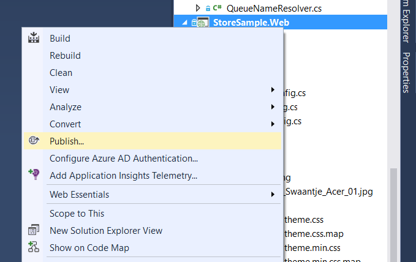
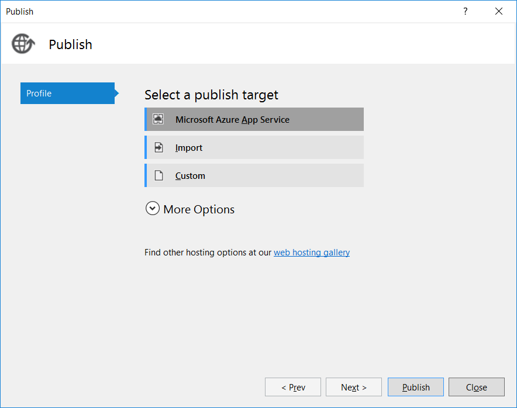
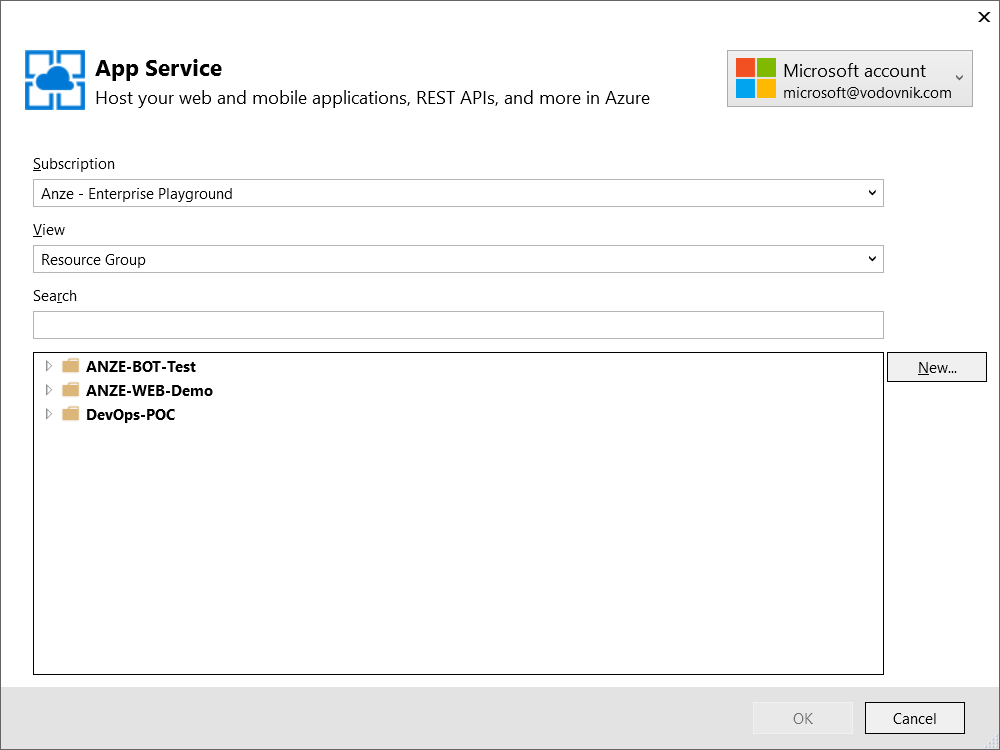
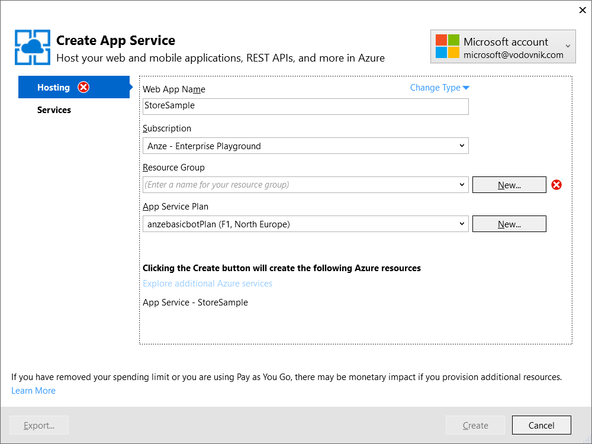
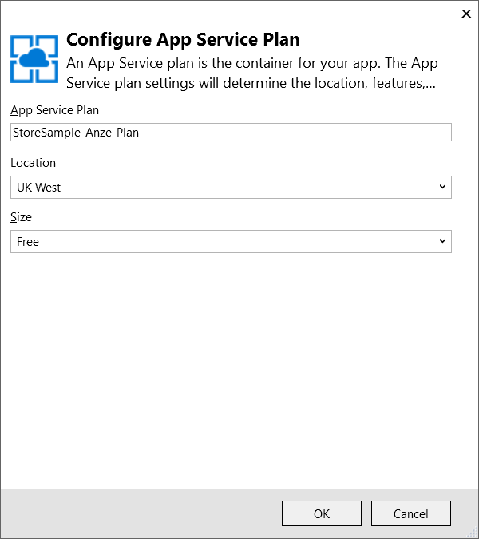
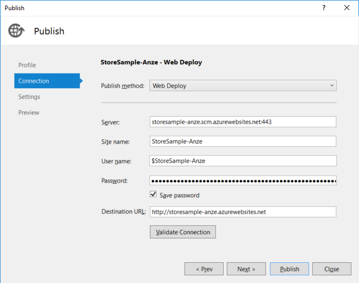
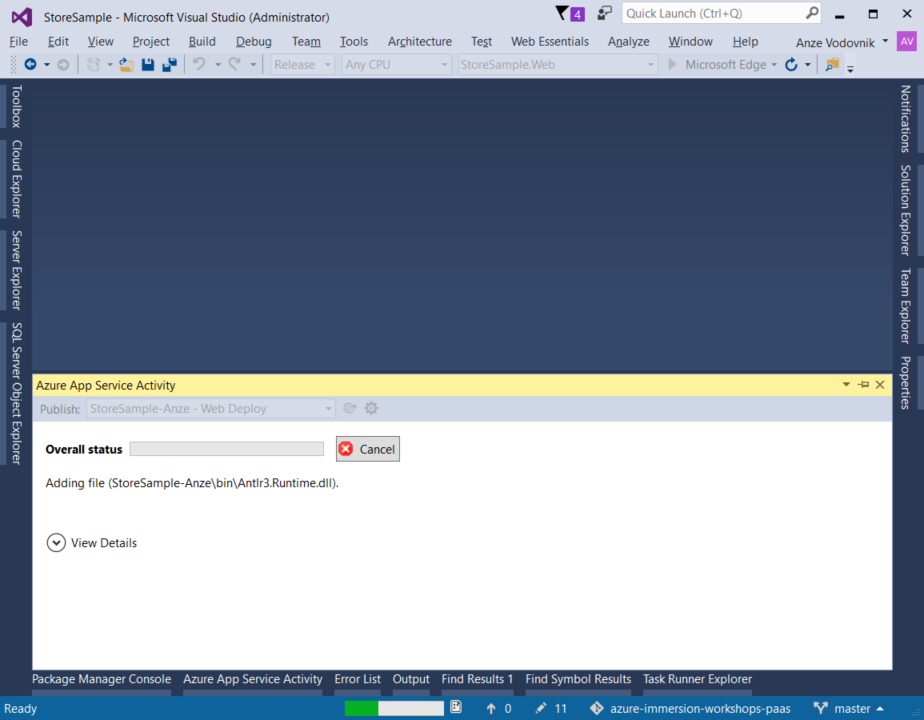
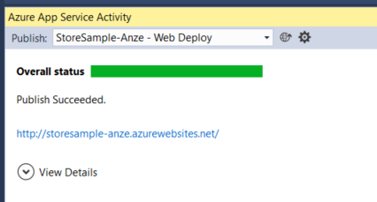

# Publishing and Scaling the Website

This scenario demonstrates how you can easily publish the project we've built in scenario 1 into _Azure_. We will use the built in facilities of Visual Studio to do that. Additionally, we will demonstrate how you can easily scale an Azure Web App to multiple nodes and take advantage of the hyper-scale cloud platform. 

## Publishing the _StoreSample_ Web App

The steps here assume that you are logged into an account that has an Azure subscription.

1. Right-click the StoreSample.Web project and select the `Publish...` option.

2. In the dialog, select the `App Service` option, as that's where we will be publishing the web. For more information on this, you can consult with the [website](https://azure.microsoft.com/en-us/services/app-service/web/).

3. If you already are signed into your Microsoft account that has an active subscription, you will see a list of subscriptions, if not, you should sign in. You can do this in the upper-right corner, by clicking `Add Account`. This will bring up a dialog where you are able to enter your credentials. As you do that, the lists should populate. 

4. Next, press the `New...` button in the middle right of the dialog to start creating the new App Service instance that will host our _StoreSample_. 

5. In the resulting dialog, we need to fill out the relevant details:
    * Name: to avoid naming conflicts, we suggest using something like `StoreSample-<yourname>`. If you see a red cross next to the name, it means that there is a conflict. Try variations in the name, e.g. appending 2 or 3.
    * Resource Group: select `PaasHandsOnRG`
    * App Service Plan: click on the `New` button on it, to create a new app service plan.

> The App Service Plan is basically a _container_ for the applications that you host. Each plan can host multiple applications. An App Service Plan is also the unit that is used for billing. You can find an in-depth overview of App Service Plans [here](https://azure.microsoft.com/en-us/documentation/articles/azure-web-sites-web-hosting-plans-in-depth-overview/) and more information on billing of App Service Plans [here](https://azure.microsoft.com/en-us/pricing/details/app-service/plans/).

6. Confirm the new app service plan, by clicking `Ok`.
7. Verify the information is correct, and select `Create` to make sure the App Service is created. 
8. You will then see the _familiar_ Web Deploy dialog, pre-populated with the credentials and URLs.

9. If you want, you can verify the changes by advancing (using the `Next >` button) to the _Preview_

> Selecting the `Start Preview` button will take a look at what files need to be published/modified/deleted. You can do this _anytime_ you publish the application manually, if you want to verify the changes that are getting published to the server. 

10. When you're happy with the changes, you can kick-off the publishing process by clicking `Publish`.
11. Visual Studio will then launch a _Build_ process in the background. Once that is completed, it wil launch the publishing process, opening the _Azure App Service Activity_ pane.

12. When complete, the pane will show `Publish Succeeded`. This also shows you the link where the site is publishing. If you click on that link, you should see the website, up and running.

## Scaling the application

Coming soon...